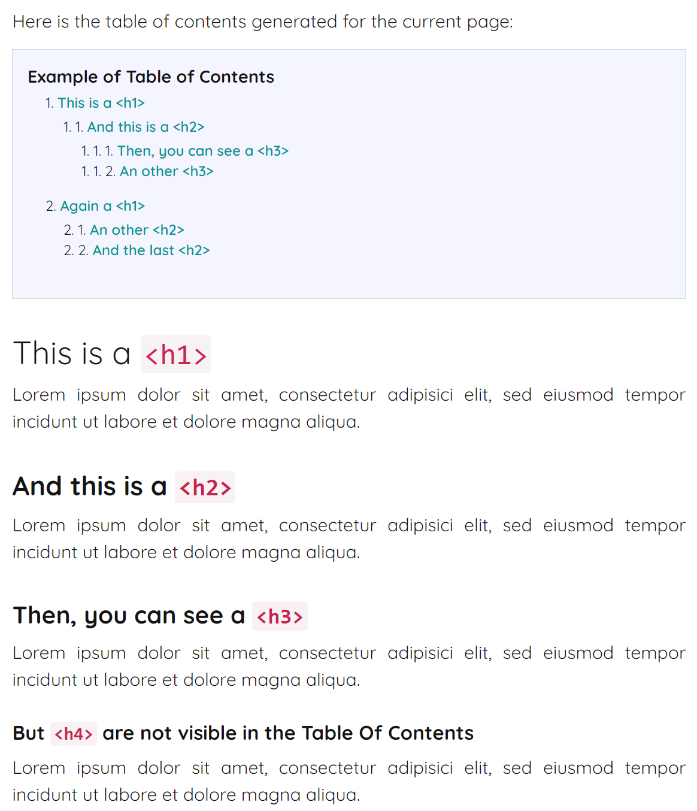

Pico Table Of Contents Plugin <!-- omit in toc -->
==================

Generate a table of contents for the pages of your [Pico](http://picocms.org) site.

- [Usage](#usage)
- [Getting Started](#getting-started)
  - [Install](#install)
  - [Update your theme](#update-your-theme)
  - [Configuration settings](#configuration-settings)
  - [Template variables defined for Twig](#template-variables-defined-for-twig)
- [Example](#example)
  - [The `index.md` file](#the-indexmd-file)
  - [Screenshot](#screenshot)
- [Changelog](#changelog)
  - [2.0](#20)
- [License](#license)


# Usage

Automatically generates a table of contents (ToC) based on the `<h1>` to `<h6>` tags.

In your Markdown file, simply add the `[toc]` marker where you want the ToC to be inserted. This marker must be added for each page you want. You must add a new line before and after the marker.

You can also add the ToC directly in your theme by using the `{{ toc }}` Twig variable in your template.

See the [configuration settings](#configuration-settings) section to see the available options.


# Getting Started

* [Install](#install) the plugin;
* [Update your theme](#update-your-theme) to add the plugin stylesheet in your Twig templates;
* Change default [configuration settings](#configuration-settings);
* [Use it](#usage) by adding the `[toc]` marker or the `{{ toc }}` Twig variable where you want the ToC to appear on your page.


## Install

Add the plugin in the `plugins` directory of your Pico installation (e.g. `/var/www/html/pico/plugins/`)
* using [Composer](https://getcomposer.org/) `composer require iridescent-dev/pico-toc-plugin`
* or manually by uploading the plugin’s files to your `plugins` directory
  - [download the latest release](https://github.com/iridescent-dev/pico-toc-plugin/releases/latest)
  - extract the archive into your `plugins` directory
  - rename the plugin's folder to `TableOfContents`

The structure should be as follows
```
plugins
└───TableOfContents
    │   style.css
    │   TableOfContents.php
    └───js
    	|   toc.js
```

Pico Table Of Contents plugin requires PHP >=7.0.

We always recommend you to use Composer whenever possible, because it makes updating the plugin way easier.


## Update your theme

In your template files, add a link to the plugin stylesheet in the `head` section:

``` twig
<!-- index.twig and/or page.twig, etc. -->
<head>
    ...
    <!-- Table Of Contents -->
    <link rel="stylesheet" type="text/css" href="{{ plugins_url }}/TableOfContents/style.css" />
    ...
</head>
...
...
<!-- TOC   -->
<script src="{{ plugins_url }}/TableOfContents/js/toc.js"></script>
</body>
```


## Configuration settings

You can change the default configuration by adding values to your `config` file. Here are the options available and what they do.
* `min_headers` - Minimum number of headers required to display the ToC. - *Default value: 2*
* `min_level` - Minimum header level displayed in the ToC. - *Default value: 1*
* `max_level` - Maximum header level displayed in the ToC. - *Default value: 5*
* `tag` - The tag used for the list. - *Default value: ol*
  *  **ol** (ordered list)
  *  **ul** (unordered list)
* `style` - The css style applied to the list. - *Default value: none*
  * **numbers** (1, 1.1, 1.2, ...)
  * **bullets** (● ○ ■)
  * **none** (no item marker is shown)
  * **default** (the default css style applied to lists)
* `heading` - Heading text, if a heading for the ToC is desired. - *Default value: (unset)*
* `toggle` - Activate the Show/Hide button or not. - *Default value: (true)*
* `initially_hide` - Hidden ToC in initial state or not. - *Default value: (true)*
* `hide_text` - The text of the button to hide the menu. - *Default value: (▲)*
* `hide_text` - The text of the button to make the menu visible. - *Default value: (▼)*

For reference, these values are set in `config/config.yml` using the following format:

``` yml
##
# Table Of Contents Plugin
#
TOC:
  min_headers: 2
  min_level: 1
  max_level: 5
  tag: ol
  style: none
  heading: Contents
  toggle: true
  initially_hide: true
  hide_text: ▲
  show_text: ▼
```

This configuration will be applied to the entire site, but it's also possible to override it for a specific page by adding the Meta headers with the same format (see the [example](#example)).


## Template variables defined for Twig

* `{{ toc }}` - The HTML code of the ToC for the current page.


# Example

## The `index.md` file

```
---
Title: Table Of Contents Example
Description: 
TOC:
  max_level: 3
  style: numbers
  heading: Example of Table of Contents
---

Here is the Table Of Contents generated for the current page:

[toc]

# This is a `<h1>`
Lorem ipsum dolor sit amet, consectetur adipisici elit, sed eiusmod tempor incidunt ut labore et dolore magna aliqua. 

## And this is a `<h2>`
Lorem ipsum dolor sit amet, consectetur adipisici elit, sed eiusmod tempor incidunt ut labore et dolore magna aliqua. 

### Then, you can see a `<h3>`
Lorem ipsum dolor sit amet, consectetur adipisici elit, sed eiusmod tempor incidunt ut labore et dolore magna aliqua. 

#### But `<h4>` are not visible in the Table Of Contents
Lorem ipsum dolor sit amet, consectetur adipisici elit, sed eiusmod tempor incidunt ut labore et dolore magna aliqua. 

### An other `<h3>`
Lorem ipsum dolor sit amet, consectetur adipisici elit, sed eiusmod tempor incidunt ut labore et dolore magna aliqua. 

# Again a `<h1>`
Lorem ipsum dolor sit amet, consectetur adipisici elit, sed eiusmod tempor incidunt ut labore et dolore magna aliqua. 

## An other `<h2>`
Lorem ipsum dolor sit amet, consectetur adipisici elit, sed eiusmod tempor incidunt ut labore et dolore magna aliqua. 

## And the last `<h2>`
Lorem ipsum dolor sit amet, consectetur adipisici elit, sed eiusmod tempor incidunt ut labore et dolore magna aliqua.
```


## Screenshot

<p align="center">
  
</p>


# Changelog
## 2.0
* Breaking changes
  * Replaces the `<toc/>` element with the `[toc]` marker to be compatible with Nextcloud.
  * Renames and restructures configuration options.
  * Override the configuration for a specific page using Meta headers instead of tag attributes.
* New features
  * Add the `{{ toc }}` Twig variable.


# License

Pico Table Of Contents Plugin is open-source licensed under the MIT License. See [LICENSE](LICENSE) for details.
